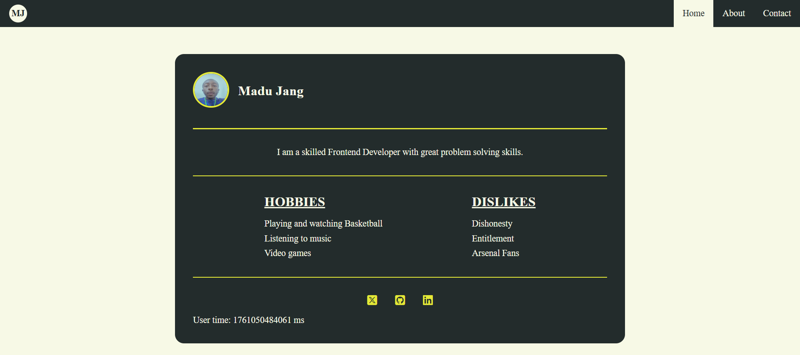

# Testable Profile Card Component by Madu Jang

## Table of contents

- [Overview](#overview)
  - [Stage 0 Task](#stage-0-task)
  - [Screenshot](#screenshot)
  - [Links](#links)
- [My process](#my-process)
  - [Built with](#built-with)
- [How to Run Locally](#how-to-run-locally)
- [Author](#author)

## Overview

### Stage 0 Task

The task is to build a small, accessible, responsive Profile Card component/page using semantic HTML and modern frontend patterns using plain HTML/CSS/vanilla JS. Every visible element must include a `data-testid` attribute so automated tests can target it.

### Screenshot



### Links

- Live Site URL: [Profile Card Component Live](https://mjspitta.github.io/profile-card-stage-0/)

## My process

### Built with

- Semantic HTML5 markup
- CSS custom properties
- Flexbox
- Vanilla JavaScript
- Mobile-first workflow

## How to Run Locally

Follow these steps to set up and view the project on your local machine:

### 1. Clone the repository

```bash
git clone https://github.com/MJspitta/profile-card-stage-0.git
```

### 2. Navigate into the project folder

```bash
cd profile-card-stage-0
```

### 3. Open the project in your code editor

```bash
code .
```

### 4. Open the site in your browser

You can open the `index.html` file directly in your browser:

- Locate the file in your project folder and double-click it, or
- Use a local development server for live reloading:

  If you have VS Code installed, you can use the Live Server extension:
  1. Install the "Live Server" extension (by Ritwick Dey).
  2. Right-click `index.html` -> select "Open with Live Server".
The site will open automatically in your browser.

## Author

- LinkedIn - [@madu-jang](https://www.linkedin.com/in/madu-jang/)
- Twitter - [@madu_jang](https://x.com/madu_jang)
- Github - [@MJspitta](https://github.com/MJspitta)
